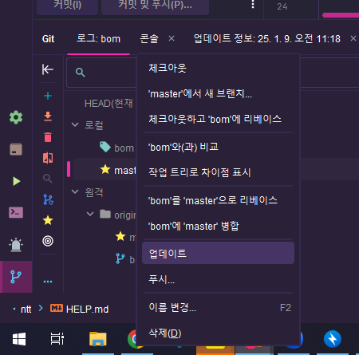
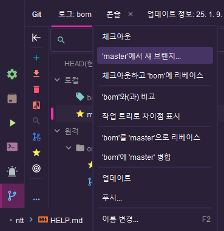
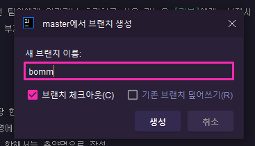
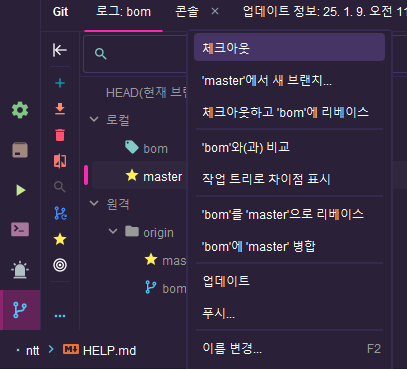

# 호텔 팀프로젝트!

## 프로그램 작성 전 공지 및 명명규칙을 꼭 확인!!

### 전체 공지
1. (추후 추가)

### Github 관련
1. 작업 전
   1) 작업 전 로컬-master 브랜치 오른쪽 마우스 클릭 
   2) 업데이트 후 master에서 새 브랜치 클릭 
   3) 자신의 이름이나 이니셜 적고 생성 버튼 클릭 
   4) 자신이 만든 브랜치가 잘 만들어졌는지 확인 후 작업 시작
2. 작업 후(푸시)
   1) 푸시한 브랜치 [권봄]이 머지
   2) 로컬-master 체크아웃 
   3) 기존 작업했던 브랜치 삭제 
   4) 1-1 부터 다시 작업시작~!
* 다른 팀원이 작업 중(담당)인 파일 수정 XX -> 충돌 발생, 파일 수정은 담당자만! (원하는게 있다면 담당자에게 전달)
* 공용 파일(properties, build.gradle, Config 등) 수정 전 팀원에게 알리거나 추가하고 싶은 기능은 [권봄]에게, 부재시 [천현종]에게 전달 
* 푸시 전 백업(폴더 째로 압축)은 필수!! 푸시 후 [권봄]에게, 부재시 [천현종]에게 전달
* !!절대!! master 브랜치에 푸시 !!!금지!!!

---
## 명명규칙
1) 명명규칙의 통일성을 위해 아래의 규칙을 따르되 Database 장 한정호 혹은 팀장인 천현종의 의견을 따른다.
2) N 이란 해당 테이블 혹은 기능의 이름이며 객체명과 메서드 명에서는 소문자로 시작한다
3) 기본적으로 단어의 풀스펠링을 적는다. 단, 흔히 쓰는 약어에 한해서는 축약명으로 작성
   - 예) 등록일 - regDate, 수정일 - modDate, Data Transfer Object - DTO 등...

### 테이블명
- 관리자
- 총판어드민
- 지사어드민
- 유저
- 매장(음식점)
- 메뉴
- 메뉴카테고리
- 방
- 주문
- 결제

### 매핑 명 규칙
- GetMapping : N + Form
- PostMapping : N + Proc

### 메소드 명 규칙
- 메소드명의 첫 글자는 소문자로 시작
- ex) ItemRegister(x) -> itemRegister(o)

### 변수명 규칙
- Pk : N + Id
- 아이디 : N + Email
- 비밀번호 : N + Password
- 연락처 : N + Tel
- 이름 : N + Name
- 등록일 : regiDate
- 수정일 : modDate
- 삭제유무 : DeleteYn
- 상대 : N + State

 

   